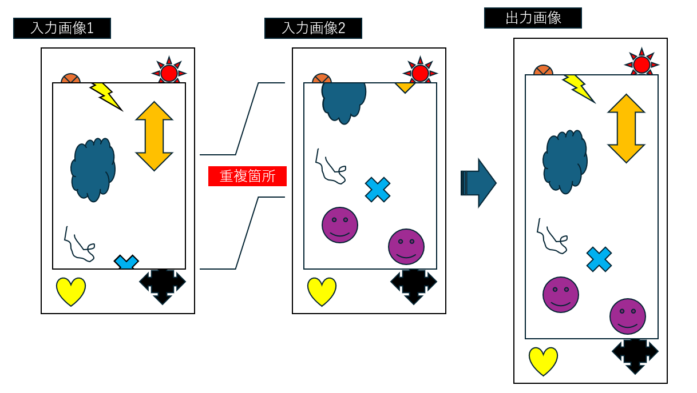

<!-- ====================== README.md ====================== -->
# 🖼️ Game‑Window Scroll Stitcher（ゲームウィンドウ・スクロールステッチャ）

ゲーム内ウィンドウを**スクロールしながら撮影した複数枚のスクリーンショット**を  
**自動的に重ね合わせて 1 枚の画像に結合**する Python パッケージです。  
横画面・縦画面のどちらでも動作し、重複領域が見つからない場合は明示的にエラーを返します。

<div align="center">
  
</div>

---

## ✨ 主な機能

| 機能 | 説明 |
| ---- | ---- |
| 🧠 **重複領域の自動検出** | テンプレートマッチング＋特徴点マッチング（ORB）＋RANSAC による外れ値除去 |
| 🪄 **シンプルな CLI** | `python -m stitcher <スクリーンショットが入ったディレクトリ> -o <出力 PNG>` |
| ↔️ **縦横どちらでも OK** | 画面の縦横に関わらず動作する。ただしすべての画像で画面サイズが同じでなければならない。 |
| 🪟 **ウィンドウ領域の抽出** | スクリーンショットに UI が写り込んでいてもゲームウィンドウだけを対象に処理 |
| 🛑 **エラーを明確に通知** | 重複が見つからない場合は `StitchError` を送出 |

---

## 📦 インストール

```bash
git clone https://github.com/your-name/game-window-scroll-stitcher.git
cd game-window-scroll-stitcher
python -m venv .venv && source .venv/bin/activate  # 任意
pip install -r requirements.txt
```

| パッケージ | 用途 |
| ---------- | ---- |
| `opencv-python` | 画像入出力とマッチング処理 |
| `numpy` | 行列計算 |
| `Pillow` | 画像入出力のフォールバック |
| `tqdm` | 進捗バー（任意） |

---

## 🚀 クイックスタート

```bash
python -m stitcher ./shots_dir -o stitched.png
```

- `shots_dir` には **連番や時系列がわかる順序**でスクリーンショットを置いてください  
  （ファイル名の昇順で処理されます）。
- ウィンドウ領域が一定であれば追加オプションは不要です。  
  動的に変わる場合は `--roi` や `--threshold` を参照してください（`-h` で一覧表示）。

---

## 🏗️ 動作原理

1. **ウィンドウ領域（ROI）検出**  
   - 指定がない場合は境界線の色分布とエッジ密度から自動抽出
2. **ペアごとの重複探索**  
   - 画像中央付近の帯をテンプレートマッチングで粗く一致検索  
   - 信頼度が低い場合は ORB 特徴点で再評価し、RANSAC で外れ値除去
3. **全体レイアウト解決**  
   - ペアごとのオフセットを累積してキャンバスサイズを決定
4. **合成**  
   - RGBA キャンバスへペーストし、重複部は線形ブレンド
5. **検証**  
   - すべての重複が閾値未満なら `StitchError` を送出

---

## 🔧 ディレクトリ構成

```
.
├─ stitcher/
│  ├─ __init__.py      # 高レベル API
│  ├─ core.py          # 重複検出とレイアウト解決
│  ├─ cli.py           # `python -m stitcher`
│  └─ utils.py
├─ tests/              # pytest 用サンプル画像
├─ docs/
│  └─ example/overview.png
├─ requirements.txt
└─ README.md
```

---

## 📝 エラーコード

| 状況 | 例外 / 終了コード |
| ---- | ---------------- |
| 重複領域が検出できない | `StitchError` / 10 |
| 入力ディレクトリが無効 | `FileNotFoundError` / 11 |
| 画像の向きが解決不能 | `StitchError` / 12 |

---

## 🤝 コントリビューション

1. Fork → ブランチ → PR
2. `pre-commit` で `black`, `ruff`, `pytest` が自動実行
3. PR にはビフォー / アフターのスクリーンショットを添付してください

---

## 📄 ライセンス

MIT License — `LICENSE` を参照
